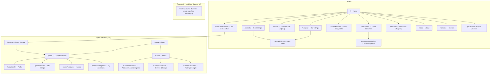
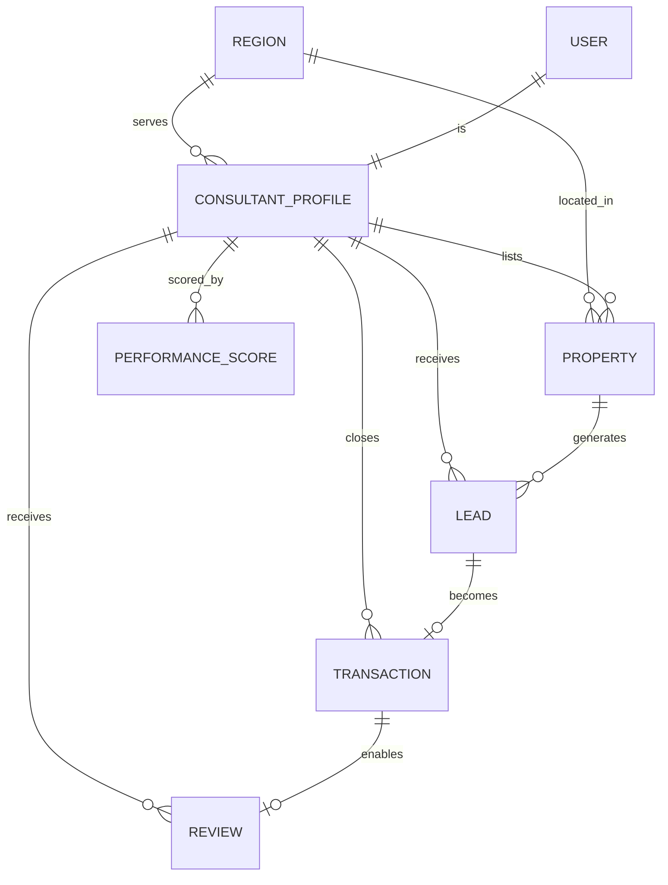
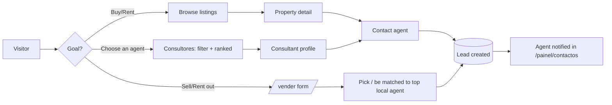

# Phase 1 — Information Architecture & Content

**Project:** RealFairTrust · Merit-based real estate marketplace (Portugal, PT/EN)
**Phase goal:** Define the **structure** — every page's purpose and sections, the
navigation, the stable URL contracts, the **content model** (entities + fields), and the
core **user flows** — so Phase 2 (wireframes) and Phase 5 (schema) have a fixed skeleton to
build against. No visual design, no code yet.
**Status:** Draft for sign-off · 2026-05-29 · Depends on Phase 0 (approved)

> This document is the **map**. Phase 2 lays out each room (wireframes); Phase 3 decorates
> (visual design); Phase 5 wires the plumbing (schema/backend). The content model in §6 is
> the load-bearing wall — we define it in full now so later DB work is additive only.

---

## 1. What Phase 1 defines

Locale/URL strategy · sitemap · route contracts · page purposes & section breakdowns ·
navigation model · **content model (entities & fields)** · user flows · feature-flag map ·
open questions to settle before Phase 2.

---

## 2. Locale & URL strategy

PT is primary, EN secondary (Phase 0). Recommended approach with next-intl:

- **Locale prefix in the path**, PT as the hidden default: `/comprar` (PT) and
  `/en/comprar` (EN), with **localized pathnames** so the PT URL reads naturally in
  Portuguese and the EN URL in English (`/comprar` ↔ `/en/buying`).
- A **language switcher** in the header preserves the current page when switching.

> **Recommendation:** localized pathnames + hidden default locale. Best for SEO (clean PT
> URLs for the primary market) and for sharing readable links. Alternative (simple `/pt`,
> `/en` prefixes everywhere) is easier but gives uglier PT URLs — not recommended.

For brevity, this document lists the **PT canonical paths**; each has an EN equivalent.

---

## 3. Sitemap

---

## 4. Route contracts (stable — do not move once set)

| PT path | EN path | Access | Status at launch |
|---------|---------|--------|------------------|
| `/` | `/en` | Public | Live |
| `/comprar` | `/en/buying` | Public | Live |
| `/arrendar` | `/en/renting` | Public | Live |
| `/vender` | `/en/selling` | Public | Live (lead form) |
| `/imovel/[id]` | `/en/property/[id]` | Public | Live |
| `/consultores` | `/en/consultants` | Public | Live |
| `/consultores/[slug]` | `/en/consultants/[slug]` | Public | Live |
| `/como-funciona` | `/en/how-it-works` | Public | Live |
| `/consultores/aderir` | `/en/consultants/join` | Public | Live |
| `/recursos` | `/en/resources` | Public | **Flagged off** (stub) |
| `/sobre` · `/contacto` | `/en/about` · `/en/contact` | Public | Live |
| `/privacidade` `/termos` `/cookies` | … | Public | Live (required) |
| `/entrar` `/registar` | `/en/login` `/en/register` | Agent/Admin | Live |
| `/painel/*` | `/en/dashboard/*` | Agent | Live |
| `/admin/*` | — | Admin | Live |

City is a **filter / query**, not a route (`/consultores?city=porto`) — so adding a city
never adds a page. (Optional SEO routes like `/consultores/porto` can be layered later
using the same template; see `docs/notes/city-expansion.md`.)

---

## 5. Page purposes & section breakdown

Each page lists: **Job** · **Primary user** · **Primary action** · **Sections**.

### Home `/`
- **Job:** explain the merit promise and send visitors to either *find a consultant* or
  *browse listings*. **User:** all. **Primary action:** "Find a consultant" / "Browse homes".
- **Sections:** Hero (kept from prototype direction: headline + dual CTA + search) → How it
  works (3 steps) → Top consultants this month (leaderboard preview, city-aware) → Featured
  listings → For clients / For consultants split → Trust & transparency (how rating works,
  link to methodology) → Join-as-consultant CTA → Footer.

### Buy / Rent `/comprar` · `/arrendar`
- **Job:** browse and filter listings. **User:** buyers/renters. **Action:** open a property
  or contact its agent.
- **Sections:** Filter bar (city/zone, price, type, beds, area) → results grid (PropertyCard:
  photo, price, key specs, agent + rating chip) → map toggle (later) → pagination/empty state.

### Property detail `/imovel/[id]`
- **Job:** present one property and convert to a lead. **User:** buyer/renter. **Action:**
  "Contact consultant".
- **Sections:** gallery → title/price/location → specs → description → energy cert → map →
  **listing agent card with performance signals + Verified badge** → lead form / contact CTA →
  similar listings.

### Find a consultant `/consultores` (the discovery + leaderboard page)
- **Job:** let clients compare consultants fairly and pick one. **User:** all clients.
  **Action:** open a consultant profile / contact.
- **Sections:** intro + methodology link → filters (city, specialization, language) → view
  toggle **Ranked (this month) ↔ All** → **Rising Talent** strip → consultant cards (photo,
  name, score/badges, close rate, response time, specialization, region) → "suggest one for
  me" (match mode, Phase 2).

### Consultant profile `/consultores/[slug]` — **the key conversion page**
- **Job:** build trust in one consultant and capture a lead. **User:** client. **Action:**
  "Contact / request a call".
- **Sections:** header (photo, name, Verified badge, region, specialization) → performance
  panel (current-month score, sub-scores, rank, Rising Talent if applicable, "building track
  record" state if low sample) → about/bio → active listings → verified reviews → contact form.

### Sell / Rent with us `/vender`
- **Job:** capture a seller/landlord lead and route it to a strong local consultant.
  **User:** seller/landlord. **Action:** submit the lead form.
- **Sections:** value prop → simple form (property location/type, contact, intent
  sell/rent) → "how we match you" explainer → optional **choose from top local consultants**
  (transparency) → confirmation.

### How rating works `/como-funciona`
- **Job:** earn trust via transparency. **Sections:** the periodic 90-day/monthly model in
  plain language → the signals & why → fairness for newcomers (Rising Talent, per-opportunity)
  → integrity/verification → FAQ.

### Join as consultant `/consultores/aderir`
- **Job:** recruit agents. **Sections:** value prop (merit visibility, fair split, Pro
  tools) → how the split/tiers work → what we expect (quality) → sign-up CTA → FAQ.

### Agent dashboard `/painel/*`
- **Job:** let an approved agent manage everything. **Sub-pages:** Profile (edit details,
  specializations, regions) · My listings (CRUD — built after auth) · Leads (incoming
  contacts, status) · **My performance** (score breakdown + coaching: exactly what to improve).

### Admin `/admin/*`
- **Job:** curate quality & integrity. **Sub-pages:** Consultants (approve/reject/suspend) ·
  Moderation (reviews, listings) · Rating oversight (recompute status, flags, health checks).

### Legal & system
- `/privacidade`, `/termos`, `/cookies` (GDPR — required at launch) · cookie-consent banner ·
  404 / error pages.

---

## 6. Content model (entities & key fields) — the schema-first backbone

Defined in full now even where the managing UI is built later, so all later migrations are
**additive only**.

| Entity | Key fields | Notes |
|--------|-----------|-------|
| **Region** | id, type(district/city/zone), parentId, name, slug, `live` flag | Powers city filtering + expansion |
| **User** | id, email, role(agent/admin; client later), authProvider, createdAt | Supabase Auth |
| **ConsultantProfile** | userId, name, slug, photo, bio, languages[], specializations[], serviceRegionIds[], contact, status(pending/approved/suspended), verified, proSubscriber, joinedAt | Public profile = the conversion unit |
| **Property** | id, agentId, type(sale/rent), title, price, regionId, zoneId, beds, baths, areaM2, energyCert, description, media[], status(draft/active/archived), createdAt | Full model now; manage-UI built after auth |
| **Lead** | id, intent(buy/sell/rent), name, contact, message, relatedPropertyId?, relatedAgentId?, regionId, status(new/contacted/closed), createdAt | Sell/rent lead ships early |
| **Review** | id, agentId, clientRef, dimensions{}, comment, verified, relatedTransactionId?, eligibleFrom, createdAt | Verification gating phased |
| **Transaction** | id, agentId, type, regionId, closedAt | Feeds close rate + verified reviews |
| **Opportunity** | id, agentId, leadId?, outcome(won/lost/active), createdAt | Enables per-opportunity normalization |
| **PerformanceScore** | id, agentId, periodMonth, windowStart, windowEnd, sub{satisfaction,closeRate,responsiveness,conversion,activity}, composite, rank, regionId, risingTalent, sampleSize, confidence | Recomputed monthly; the engine output |

> **Recommendation:** model all nine entities in the Phase 5 Supabase schema from day one
> (even Transaction/Opportunity/Review, lightly used at launch). This is what guarantees
> listings and the rating engine can grow without rewrites.

---

## 7. Navigation model

- **Header:** logo → Comprar · Arrendar · Vender · Consultores · Como funciona → language
  switch (PT/EN) → "Entrar" (agent) → primary CTA "Falar com um consultor".
- **Footer:** four columns — Explorar (buy/rent/sell/consultants) · Para consultores
  (join/how-it-works/Pro) · Empresa (about/contact/resources) · Legal (privacy/terms/cookies)
  → language + socials.
- **Authenticated nav** (dashboard): collapses to the `/painel` side-nav.
- **Breadcrumbs** on listings and profiles for orientation + SEO.

---

## 8. Core user flows

Other flows (described, diagrammed in Phase 2 where useful):
- **Agent onboarding:** Aderir → Registar → submit profile → **Admin approves** → profile
  live → create listings → receive leads → performance tracked.
- **Admin:** review pending agents → approve/reject → moderate reviews/listings → monitor
  rating health.
- **Rating computation (monthly system job):** gather last-90-day signals per agent →
  normalize per opportunity → compute sub-scores + composite → rank within region/
  specialization → assign Rising Talent / confidence states → publish to profiles & boards.

---

## 9. Feature-flag map (launch state)

| Feature | Launch | Notes |
|---------|--------|-------|
| Buy/Rent browse + property detail | ON | Read from real/seed listings |
| Sell/Rent lead form | ON | Lightweight, no listing-CMS dependency |
| Consultant discovery + profiles + ranking | ON | Core value |
| Agent dashboard + listing CRUD | ON | After agent auth |
| Admin curation | ON | |
| Verified-transaction review gating | OFF | Manual moderation at launch; gating in Phase 2 |
| Match mode ("suggest a consultant") | OFF | Phase 2 |
| Client accounts / favorites / saved searches / messaging | OFF | Designed-for, built later |
| Resources hub | OFF | Stub route reserved |
| Map view on listings | OFF | Phase 2/3 enhancement |

---

## 10. Open questions to settle before Phase 2

Each with a recommendation — confirm or adjust.

1. **Public score display:** show the numeric composite on profiles from day one, or show
   **badges + "building track record"** until an agent hits the minimum sample size?
   *Rec: badges first, reveal the number once the sample is statistically fair.*
2. **Seller lead routing:** auto-assign to the top local agent, round-robin top N, or **let
   the client pick from the top matching consultants**? *Rec: client picks from top N (most
   transparent + fair); offer a "suggest for me" option.*
3. **Listings at launch:** real listings from onboarded agents only, or seed/demo listings
   to avoid an empty marketplace on day one? *Rec: seed a curated set per launch city, clearly
   flagged, until real inventory builds.*
4. **Locale URLs:** confirm localized pathnames + hidden default (§2). *Rec: yes.*
5. **Consultant slug:** name-based (`/consultores/ana-silva`) with collision handling?
   *Rec: yes, name-slug + numeric suffix on collision.*
6. **Reviews at launch:** collect reviews from day one (manually moderated) or wait for the
   verification system? *Rec: collect with manual moderation now; tighten with gating in Phase 2.*

---

## 11. Phase 1 exit criteria (sign-off)

Phase 1 is complete when the sitemap, route contracts, page purposes, navigation, content
model, and core flows are approved, and §10 is answered. On sign-off we proceed to **Phase 2
— Wireframes / UX**: low-fidelity layouts of every page above, screen by screen.

> **Next action:** review → answer §10 → tell me to start Phase 2. Hand this file to Claude
> Code so it can scaffold the **empty routes/folders** per §3–§4 behind feature flags (no
> feature logic yet).
